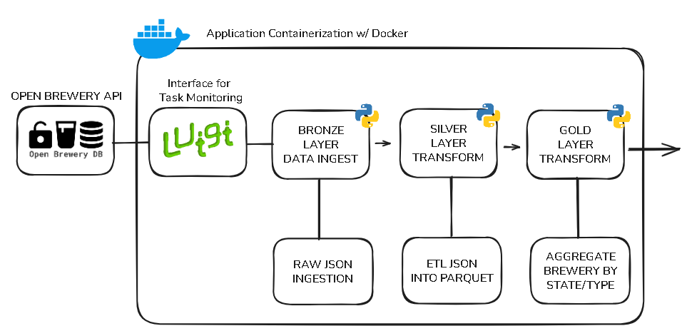

# Luigi Pipeline - Open Brewery DB – Medallion Architecture



## Design Choices
- Medallion Architecture: Mandatory structure for the environment, we configure the pipeline into three layers (Bronze, Silver, Gold), although the mandatory check we use this schema to ensure better organization, scalability, and separation of concerns.
- Luigi: Used as the orchestration tool due to its simplicity, modularity, and ability to manage task dependencies. Luigi allows for step-by-step execution and dependency resolution in a lightweight environment.
- Modularity: The project is organized into separate scripts for ingestion, transformation, and aggregation tasks, making it easy to maintain, debug, and extend.
- Containerization: Docker is used to containerize the application, ensuring consistency across environments and simplifying deployment and testing.
- Libs:
- - Pandas: Chosen for data processing due to the relatively small dataset size and ease of integration with Luigi. It provides efficient tools for handling JSON and Parquet files.
- Flow Description
- - Bronze Layer: Data is ingested from the Open Brewery DB API and saved "as is" in JSON format.
- - Silver Layer: The raw data is transformed into a structured format (Parquet), partitioned by state for optimized querying and storage.
- - Gold Layer: Aggregations are applied (e.g., brewery counts by type and state), and the final dataset is saved in Parquet format, ready for consumption.

## Project Structure
```
LUIGI_BREWERIES_PIPELINE/
├── dags/                  # Luigi pipeline definition
│   └── brewery_pipeline.py
├── data_lake/             # Data lake with medallion architecture (Bronze, Silver, Gold layers)
│   ├── bronze/            # Raw data from the API
│   ├── silver/            # Transformed and partitioned data
│   └── gold/              # Aggregated data
├── logs/                  # Luigi logs
├── tasks/                 # ETL task scripts
│   ├── __init__.py        
│   ├── bronze_to_silver.py
│   ├── data_ingestion.py
│   ├── silver_to_gold.py
├── .gitignore             # Git ignore file
├── docker-compose.yml     # Docker Compose configuration
├── Dockerfile             # Docker image definition
├── README.md              # Documentation
└── requirements.txt       # Python dependencies
```

## How to Run It
- Install Docker Desktop on your machine: https://www.docker.com/get-started/
- Run the docker compose command: docker-compose up --build
- Access the Luigi web interface at: http://localhost:8082

- Run the pipeline step-by-step or all at once. To run step-by-step you can navigate through each class of transformations, from Bronze to Gold, if you want to run all at once, just follow the instructions for the Gold Layer:
- - Step 1: Bronze Layer (Data Ingestion): 
    ```
    Run docker ps inside the terminal to get the conainter_id
    Run the command docker exec -it <container_id> python dags/brewery_pipeline.py FetchRawData --local-scheduler
    ```
- - Step 2: Silver Layer (Transform Bronze → Silver): 
    ```
    Run docker ps inside the terminal to get the conainter_id
    Run the command docker exec -it <container_id> python dags/brewery_pipeline.py TransformToSilver --local-scheduler
    ```
- - Step 3: Gold Layer (Aggregate Silver → Gold): 
    ```
    Run docker ps inside the terminal to get the conainter_id
    Run the command docker exec -it <container_id> python dags/brewery_pipeline.py AggregateToGold --local-scheduler
    ```

Verify the outputs:
Bronze Layer: Check data_lake/bronze for the raw JSON file.
Silver Layer: Check data_lake/silver for Parquet files partitioned by state.
Gold Layer: Check data_lake/gold for the aggregated Parquet file.

## Future Improvements / Trade-offs
As a straight foward timeboxed project, the current implementation serves as a baseline. We made trade-offs based on speed, difficulty level, and we have space for later improvements:

- Cloud Integration: We ran the service localy, but we could use MinIO to mock the cloud environment, or even use Azure DataLake storage, AWS s3 or GPC Storage instead of local directories. This could give us more scalability and control under the access on the data.
- Distributed Processing: Replace Pandas with PySpark to handle larger datasets and enable distributed data processing. In a large data scenario we can also use DBT allocating the data from DB Brewery in a relational dabatase (PostgreSQL) and use SQL to ETL the layers for the medalion schema.
- Monitoring and Alerts: We can add scenarios for monitoring and alerting triggers using tools like Slack notifications.
- Enhanced Testing: Create specific and isolated test scnearios for data validation to cover not only the common exceptions, adding more test coverage.

## Support Material Used
Open Brewery DB API Documentation: https://www.openbrewerydb.org/documentation
Luigi Documentation: https://luigi.readthedocs.io/en/stable/